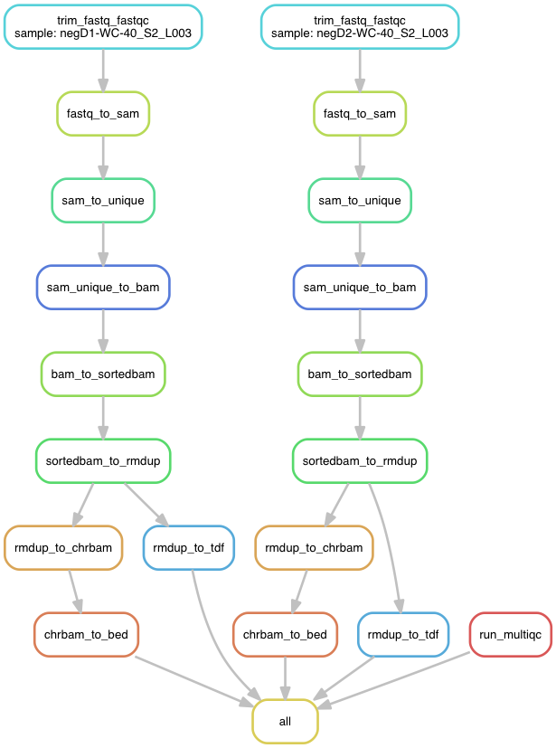

# NGS-Data-Charmer:

This repository hosts an automated NGS data analysis pipeline (ChIP-seq and RNA-seq) created using Snakemake. 

## Dependency:
- [Anaconda](https://conda.io/docs/user-guide/install/linux.html) 

## Installation:
Clone this repository and change into the cloned NGS-Data-Charmer directory. 

To create an environment using the environment.yaml file, type the following:

`conda env create -f environment.yaml`

This will create a conda environment called ngs_data_charmer.

## Usage on a local machine:

Copy the config.yaml, run_snakemake.sh and Snakefile to your NGS project directory. This directory should also contain a directory called 'fastq' wherein all the fastq files are placed. Make sure the project directory structure is as follows:
```
.
├── config.yaml
├── fastq
│   ├── D1-WC_S2_L003_R1_001.fastq.gz
│   └── D1-WC_S2_L003_R2_001.fastq.gz
├── run_snakemake.sh
└── Snakefile
```
Make the required changes to the config.yaml file.

Next, type `sh run_snakemake.sh` or `nohup sh run_snakemake.sh &` (to run in background).

## Usage on an LSF cluser:

Copy the config.yaml, run_snakemake_cluster.sh, cluster.json and Snakefile to your NGS project directory. This directory should also contain a directory called 'fastq' wherein all fastq files are placed. Make sure the project directory structure is as follows:
```
.
├── cluster.json
├── config.yaml
├── fastq
│   ├── negD1-WC-40_S2_L003_R1_001.fastq.gz
│   └── negD1-WC-40_S2_L003_R2_001.fastq.gz
├── run_snakemake_cluster.sh
└── Snakefile
```
Make the required changes to the config.yaml and cluster.json file.

Next, type `nohup sh run_snakemake_cluster.sh &` (to run in background).

## Steps in RNA-seq pipeline:

 

## Steps in ChIP-seq pipeline:

 

## Additional Snakemake options:

You can also customize the run_snakemake.sh and run_snakemake_cluster.sh scripts according to your own needs. You might wish to change the number of cores snakemake uses. Or you might want to do a dryrun. To explore additional options available in snakemake, type:

`source activate rnaseq_charmer`

followed by 

`snakemake --help`
